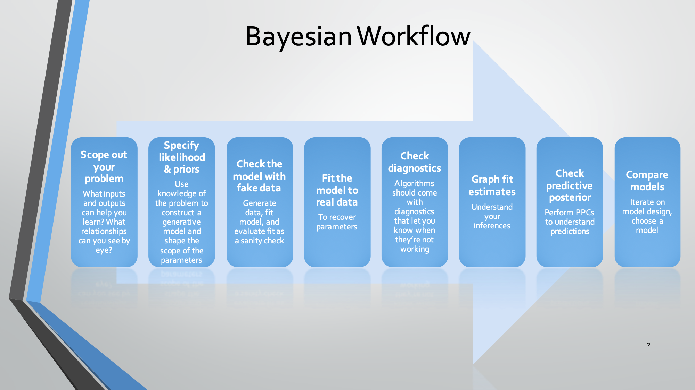

```{r setup, include=FALSE}
library(tidyverse)
library(printr)
library(Bolstad)
## xaringan::inf_mr('16_ch14_linReg1.Rmd')
```

# i. Admin & Startup

## Week 10 Focus

- Receive and act on HW 7 Ch. 11-13 HW feedback.
- Practice on HW8 Ch. 14 content.
- Read Ch. 14. Linear regression
- HW 8. Ch.14 due Friday Apr 2.

## HW 7 general feedback

- ???

## Today's plan

- Prime by discussion via HW 8, ch. 14 exercise prompts.
- Discuss Ch. 14, Part 1.
- Summarize, Revisit HW or Q & A

*Please contribute questions and comments*

# I. Preview HW 8

- Ch. 14: 2 ,4, C1-C3

# Motivating data

- How well does the first midterm score predict the second midterm score?

```{r, include = FALSE, eval = FALSE}
## Import and scramble midterm one and midterm two scores
all_dat <- read.csv("~/OneDrive - University of Nevada, Reno/Teaching/STAT_446_646/Student_Work_SP20/2020-03-30T0822_Grades-STAT_446.646.1001_Combined_(STAT)_Sections.csv", na.strings = "N/A")
## retrieve Midterm 1, 2. Remove non-student rows
reg_data <- all_dat[ -c(1, nrow(all_dat) ), c("Midterm.1..532867.", "Midterm2_SP20..553424.", "Midterm2_SP20..553425.")]
## merge Midterm 2 versions
reg_data$MidtermTwo <- reg_data[ , 3]
reg_data$MidtermTwo[is.na(reg_data$MidtermTwo)] <- na.omit(reg_data[ , 2])
## scramble order and relabel rows, remove the duplicated info
## Typically one would set the seed before calling sample.
## But this would allow someone to identify grades
## if they worked hard enough.
reg_data <- reg_data[sample(1:nrow(reg_data)),  c(1, 4)]
rownames(reg_data) <- 1:nrow(reg_data)
names(reg_data) <- c("MidtermOne", "MidtermTwo")
## convert to percentages
reg_data <- 2*reg_data
## save in R friendly format
saveRDS(reg_data, "data/exam_reg_data.rds")
```

## Midterm data from SP20

```{r, examData}
reg_data <- readRDS("data/exam_reg_data.rds")
str(reg_data)
```

## Midterm data from SP20

```{r, examData2}
head(reg_data)
```

## Midterm data from SP20

```{r, examData3}
summary(reg_data)
```

## Midterm data from SP20

```{r, examData4}
cor(reg_data)
var(reg_data)
```

## Midterm data from SP20

```{r, examDataViz}
p0 <- ggplot(data = reg_data, aes(x = MidtermOne, y = MidtermTwo) ) 
p0 + geom_point(alpha = 0.5) ## overlaying points so let's use translucency
```

# I. Compute the least squares (LS) estimates from these data (14.1)

## Least squares regression

1. Discuss Figure 14.1.

2. Minimizing squared residuals: $SS_{res} = \sum_{i=1}^n \left[ y_i - (\alpha_0 + \beta x_i) \right]^2$ on p. 285.

LS Solution for $\beta$:  
$B = \frac{\overline{xy} - \overline{x}\overline{y}}{\overline{x^2} - \overline{x}^2}$.

LS Solution for $\alpha_0$:  
$A_0 = \overline{y} - B \overline{x}$.

The final LS solution is $y = A_0 + Bx$.

An important alternative form is  

$y = \overline{y} - B\left( x - \overline{x} \right)$.

3. Discuss Example 14.1 and figure 14.2.

**Make sure to keep all significant digits** when calculating LS.

## Estimating the variance around the LS line

```{r}
compute_simple_ls <- function(x, y) {
    B <- ( mean(x*y) - mean(x) * mean(y) ) / ( mean(x^2) - mean(x)^2  )
    A0 <- mean(y) - B * mean(x)
    return( list(A0 = A0, B = B) )
}

estimate_var_simple_ls <- function(x, y) {
    ls_soln <- compute_simple_ls(x = x, y = y)
    fits <- ls_soln$A0 + ls_soln$B * x
    residuals <- y - fits
    return( ( 1 / (length(y) - 2) ) * sum( residuals^2 ) )
}
    
```

## Produce the LS solution for our exam data

```{r, echo = TRUE, results = TRUE}
## Standardization is usually recommended, but to keep the scale clear
## for teaching purposes we fit to the original data

(my_ls_soln <- compute_simple_ls(x = reg_data$MidtermOne, y = reg_data$MidtermTwo))

## compare to stats::lm()
lm(MidtermTwo ~ MidtermOne, data = reg_data)
```

## Produce the LS solution for our exam data

```{r ls2}
p0 <- ggplot(data = reg_data, mapping =  aes(x = MidtermOne, y = MidtermTwo))
p1 <- p0 + geom_point(alpha = 0.5, size = 5) + geom_abline(intercept = my_ls_soln$A0, slope = my_ls_soln$B)
p1
```

## Produce the LS solution for our exam data

```{r}
ols_fit <- lm(MidtermTwo ~ MidtermOne, data = reg_data)
summary(ols_fit)
```

## II. Exponential growth model as a linear model after transformation

Often data do not display a linear trend, but one that reflects an increasing rate and variation as the predictor's value increases. 

In this case an exponential growth model will usually give a better fit:

$u = e^{\alpha_0 + \beta \times t}$. Then if we let $y = log(u)$, (here $log := log_e$)  

$y = \alpha_0 + \beta \times t$.

Then you can find the LS solutions for the two parameters and back-transform to convert back to the original scale.

### Discuss Example 14.2 and Figure 14.3.

## III. Adding probablistic assumptions (14.3)

There has been no probability or error modeling in the LS solution. It is called *distribution free* for this reason. So one can find the best fitting line with respect to the quadratic loss function, but there is no uncertainty quantification. Let's add some probablisitc/statistical assumptions to meet this goal:

1. Mean assumption: The conditional mean of $y | x$ is an unknown linear function of $x$.  

$\mu_{y|x} = \alpha_0 + \beta x$ or, equivalently, $\mu_{y|x} = \alpha_{\overline{x}} + \beta \left( x - \overline{x} \right)$.

2. Error assumption. Observation equals mean plus error, which is *normally* distributed with mean 0 and **known** variance $\sigma^2$ All errors have equal variance.

3. Independence assumption. The errors for all observations are independent of each other

See argument on p.291 and discuss Figure 14.5.

### How well do are data meet these assumptions?

## Bayes Theorem for the regression model (14.4)

Bayes, theorem is always described as

$posterior \propto prior \times likelihood$. Let's first discuss the joint likelihood.

Let's walk through the derivation on p.293-294.

How does this relate to the frequentist approach of Maximum Likelihood Estimation (MLE)?

## Bayesian model development workflow 

For real problems, I recommend the following Bayesian model development workflow:

```{r label, out.width = "85%", fig.cap = "From Gabry et al. StanCon 2018", echo=F}

```

Learn more from the following preprint:

[Visualization in Bayesian workflow](https://arxiv.org/pdf/1709.01449.pdf)

## Closing

Think-pair-share:

- Why do we bother with making probabilistic modeling assumptions instead of just giving the least squares solution?

```{r, message=F, echo=F}
p1+ geom_smooth(method = "lm")
```
