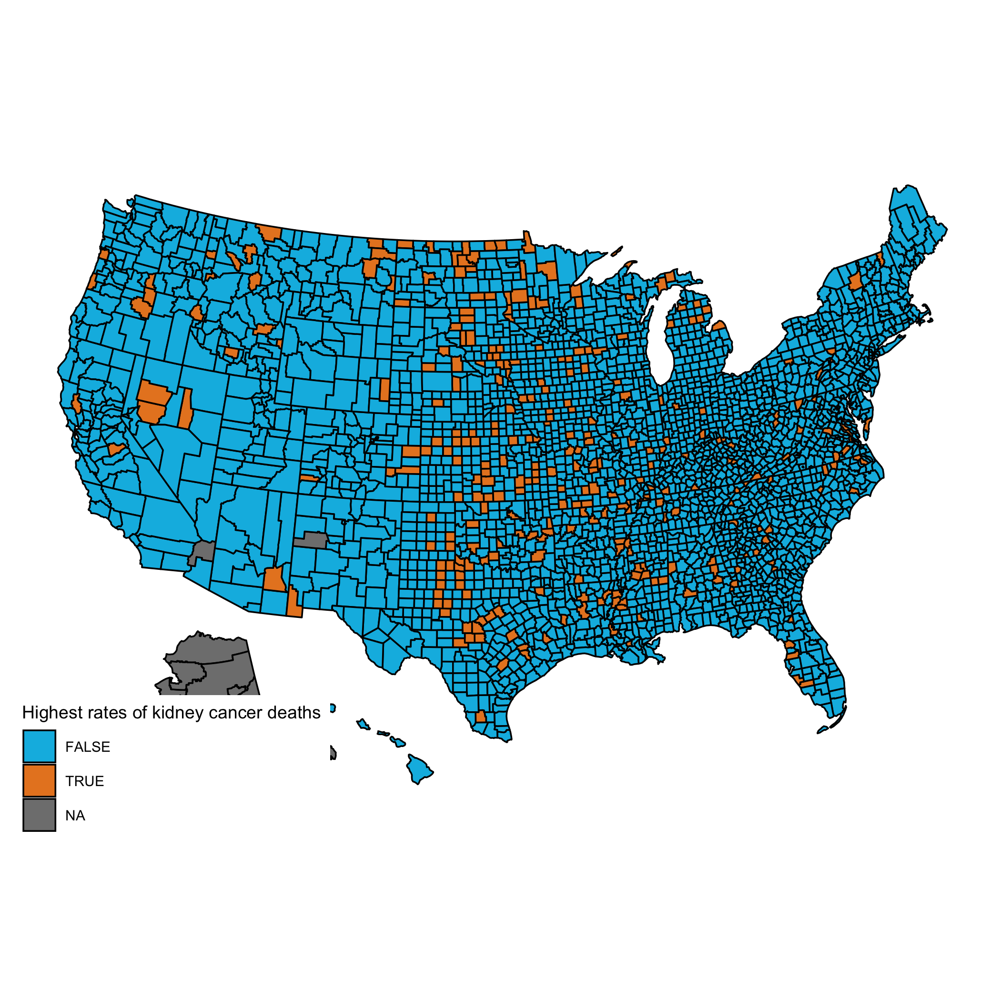
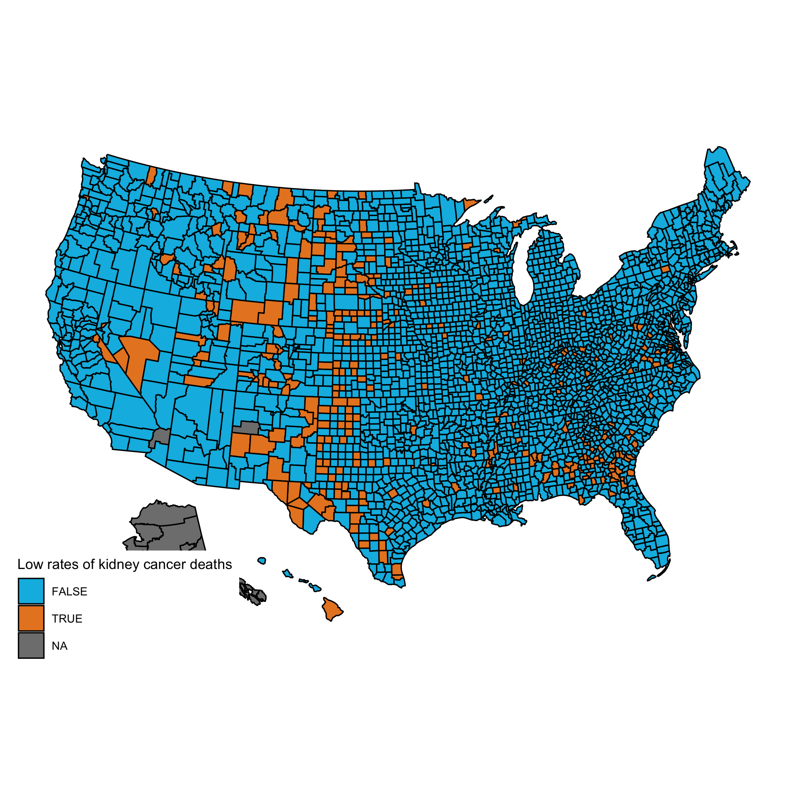

```{r setup, include=FALSE}
knitr::opts_chunk$set(echo = TRUE)
library(ggplot2)
```

## Start of class work: Motivation for Bayesian Multilevel Regression

### Recall the maps of cancer rates from the first lesson:

```{r kidneyHigh, out.width = "85%", fig.cap = "The counties of the United States with the highest 10% age-standardized death rates for cancer of kidney/ureter for US. white males, 1980 - 1989. Why are most of the shaded counties in the middle of the country?", echo = F}

```

```{r kidneyLow, out.width = "85%", fig.cap = "The counties of the United States with the lowest 10% age-standardized death rates for cancer of kidney/ureter for US. white males, 1980 - 1989. Why are most of the shaded counties in the middle of the country?", echo = F}

```

The goal was to esitmate the rate of kidney cancer for each US county. But the rate rare is so counties with small populations are problematic. This is because a single case could give a large MLE (classical/frequentist) of the proportion. How can we correct for this?

1) ?

2) Multilevel (hierarchical) modeling that borrows information across states to stabilize and improve estimation.

## Today's lesson is derived from Gelman and Hill Ch. 1, 3, 4

Most of these notes are direct quotes, paraphrases, and adaptations from 

[Data Analysis Using Regression and Multilevel/Hierarchical Models (Gelman and Hill 2007)](http://www.stat.columbia.edu/~gelman/arm/)

Your exercises will also be derived from the same textbook. You can find data sets and examples here:

http://www.stat.columbia.edu/~gelman/arm/software/

### The `arm` R package

I recommend you install the Applied Regression Modeling R package: `arm`. It has helpful convenience functions for fitting Bayesian (multilevel) regression modeling and simulating from these models.

```{r arm, echo = T}
## From CRAN
## install.packages("arm")
library(arm)
```

## Ch.1 What is multilevel regression modeling?

I'll begin by describing the motivation for multilevel (aka hierarchical) modeling.

## Eight schools data

There are famous data called *eight schools* that Prof. Andrew Gelman, Columbia, popularized in BDA3.

A blog discusses one learner's experience with the data
https://statmodeling.stat.columbia.edu/2014/01/21/everything-need-know-bayesian-statistics-learned-eight-schools/

I won't describe the data in detail, but here is a brief description: Consider an educational study with data from students from different schools, predicting in each school the students grades $y$ on a standardized exam given their scores of a pre-test $x$
and other information. A separate regression can fit within each school (*single-level regression*), and the parameters from these schools can themselves be modeled as depending on school characteristics (SES status of school's neighborhood, public/private school, etc). The student-level regression and the school-level regression here are the two of a *multilevel model*.  Three equivalent ways to express a multilevel model in this setting:

- A model in which the coefficients vary by school (thus, instead of a model such as $y=\alpha + \beta x +$ error, we have $y= \alpha_j + \beta_j x +$ error, where the subscripts $j$ index schools),  
- A model with more than variance component (student-level and school-level variation),  
- A regression with many predictors, including an indicator variable for each school in the data.

The key feature that distinguishes multilevel models from classical regression is in the *modeling of the variation between groups* (here schools).

## Ch. 3 Single-level regression: basics and practical issues

Before we begin multilevel modeling, we'll discuss practical issues of single-level regression, including fitting, understanding, and visualization. We have already see single-level regression in chapters 14 and 19 in Bolstad and Curran, but we focused on Bayesian inference in conjugate models.

### 3.1 One predictor

We studied Bayesian inference for this case in Ch. 14 Bolstad and Curran. But now let's focus on understanding the model. First it is helpful to think about linear regression as a method that "*summarizes how the average values of a numerical outcome value vary over subpopulations defined by linear functions of predictors.*" Rather than thinking about linear regression as a mathematical description of a relationship/association between variables. This insight will help you interpret the coefficients later.

We will work through an example that modeling children's IQ test scores using their mother's characteristics.

```{r child.iq, echo = T}
## The data are stored in a STATA file
## install.packages("foreign")
library(foreign)
kid <- read.dta("./data/kidiq.dta")
## str(kid)
binary_fit <- lm( kid_score ~ mom_hs, data = kid )
## the rounding only to make the discussion easier and more readibility
myCoef <- unname(round(coef(binary_fit)))
```

#### A single binary predictor

*For a binary predictor, the regression coefficient is the difference between the averages of the group*.

We start by modeling the children's test scores given an indicator for whether the mother graduated from high school (coded as 1) or not (coded as 0).

The ordinary least squares fit gives:

$$
kid.score = `r myCoef[1]` + `r myCoef[2]` momHS + error,
$$

But let's focus on the deterministic part:

$$
\hat{kid.score} = `r myCoef[1]` + `r myCoef[2]` momHS,
$$

Where the "hat" denotes predicted or expected test given the `mom.hs`predictor.

The model summarizes the difference in average test scores between the two subpopulations (students with mothers who completed high school vs not). So the slope is interpreted the expected (average) difference, `r myCoef[2]` points higher for students with mothers who completed high school, compared to those whose mother's did not.


```{r out.width = "85%", fig.cap = "Child's IQ test scores versus mother's high school status."}
ggplot( data = kid, aes( x = mom_hs, y = kid_score ) ) + geom_jitter(width = 0.1) + geom_smooth( method = "lm", se = F)
```


#### Regression with a continuous predictor

Now we predict kid's IQ using mother's IQ.

```{r}
cont_fit <- lm( kid_score ~ mom_iq, data = kid )
myCoef <- unname(round(coef(cont_fit), 1))
```


```{r out.width = "85%", fig.cap = "Child's test scores versus mother's IQ test score."}
ggplot( data = kid, aes( x = mom_iq, y = kid_score ) ) + geom_point() + geom_smooth( method = "lm", se = F)
```

$$
kid.score = `r myCoef[1]` + `r myCoef[2]` momIQ + error,
$$

The expected increase in kid's score for an increase of 1 point in Mom IQ is 0.6 ponits. Or the average increase expected of a child's IQ for a 10-point increase in mother's IQ is 6 points.

### 3.2 Multiple predictors

Now we fit both predictors at once.

```{r section32}
ols_fit <- lm( kid_score ~ mom_hs + mom_iq, data = kid )
myCoef <- unname(round(coef(ols_fit), 1))
```

$$
kid.score = `r myCoef[1]` + `r myCoef[2]` momHS + `r myCoef[3]` momIQ + error,
$$

```{r out.width = "85%", fig.cap = "Child's test scores versus mother's IQ test score."}
ggplot( data = kid, aes( x = mom_iq, y = kid_score, color = factor(mom_hs) ) ) + geom_point() + geom_abline(intercept = myCoef[1] + myCoef[2], slope = myCoef[3]) + geom_abline(intercept = myCoef[1], slope = myCoef[3])
```

Same slope!

Interpretations:

*The intercept*. The expected kid score with mother IQ is 0 and did not finish high school. This is not a useful prediction.

*The coefficient of mother high school completion*. Same as before comparing averages between the subpopulations.

*The coefficient of mother's IQ*. This is the same as before except the 6-point expected increase for 10-point increase in mother's IQ refers to children with the same status of mother's education.

### 3.3 Interactions

Now we fit both predictors at once.

```{r section33}
ols_fit <- lm( kid_score ~ mom_hs*mom_iq, data = kid )
myCoef <- unname(round(coef(ols_fit), 1))
```

$$
kid.score = `r myCoef[1]` + `r myCoef[2]` momHS + `r myCoef[3]` momIQ  + `r myCoef[4]` momHS * momIQ + error,
$$

```{r out.width = "85%", fig.cap = "Child's test scores versus mother's IQ test score."}
ggplot( data = kid, aes( x = mom_iq, y = kid_score, color = factor(mom_hs) ) ) + geom_point() + geom_smooth( method = "lm", se = F)
```

**Care must be taken in interpreting the coefficients.**

1. *Intercept* is the same

2. *The coefficient of momHS* Same.

3. *The coefficient of momIQ* The comparison of mean test scores across children whose mothers did not complete HS, but who mothers IQ differ by 1 point.

4. *The coefficient on the interaction term*. In the *difference*in the slopes for momIQ.

Just plug in values into the fitted model to see algebraically why this is true.

### 3.4 Statistical Inference

Let's discuss inference from the model output.

```{r section34}
ols_fit <- lm( kid_score ~ mom_hs*mom_iq, data = kid )
display(ols_fit)
```

### 3.5 Graphical displays

### 3.6 Assumptions and diagnostics

```{r section35}
plot(resid(ols_fit))
```

Assumptions in decreasing order of importance.

1. Validity

2. Additivity and linearity

3. Independence of errors

4. Equal variance of errors

5. Normality of errors

### 3.7 Predication and validation

```{r section37}
x_new <- data.frame (mom_hs = 1, mom_iq = 100 )
predict(ols_fit, x_new, interval = "prediction", level = 0.95)
```

## Closing

3-2-1:

3 Concepts you learned today
2 R functions that we new to you
1 Question you have  


