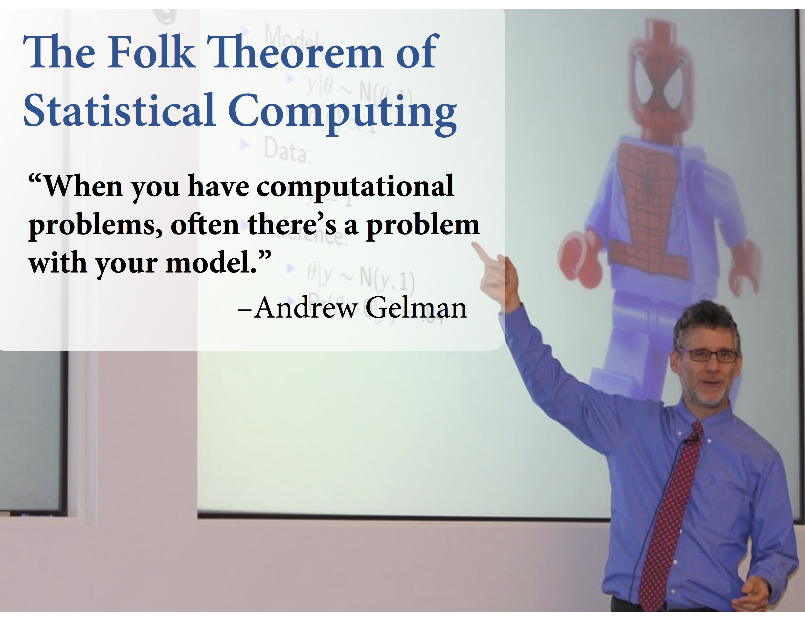

```{r setup, include=FALSE}
knitr::opts_chunk$set(cache=TRUE, autodep=TRUE, cache.comments=TRUE)
```

<bring to class: laptop>

# Essential question: What is Hamiltanion Monte Carlo (HMC) and how do we use it to do Bayesian inference?

## Start-of-class work (5 - 10 min)

Watch a Metropolis algorithm "get stuck" on the "donut" example. Discuss why this may be occurring.

[mcmc demo](https://chi-feng.github.io/mcmc-demo/)

## I. Why HMC? (Ch.20; 5 - 10 min)

### Overview of MCMC Strategies

- Metropolis: Granddaddy of them all
- Metropolis-Hastings (MH): More general
- Gibbs sampling (GS): Efficient version of MH
- Metropolis and Gibbs are "guess and check" strategies
- Hamiltonian Monte Carlo (HMC) fundamentally different - uses the gradient
- New methods being developed, but future belongs to the gradient

Excellent reference text: Brooks, S., Gelman, A., Jones, G., & Meng, X. L. (Eds.). (2011). *Handbook of markov chain monte carlo.* CRC press.

### Problem with Gibbs sampling (GS)

- High dimension spaces are concentrated
- GS gets stuck, degenerates towards random walk
- Inefficient because re-explores 

### Hamiltonian dynamics to the rescue

- represent parameter state as particle
- flick it around frictionless log-posterior
- record positions
- no more "guess and check", as (nearly) all proposals are good proposals

## II. Brief overview of HMC (5 - 10 min)

From MacKay, David JC. *Information theory, inference and learning algorithms.* Cambridge university press, 2003.

"The HMC method is a Metropolis method, applicable to continous state spaces, that makes use of gradient information to reduce random walk behavior... It seems wasteful to use a simple random-walk Metropolis method when this gradient is avaiable - the gradient indicates which direction one should go in to find states that have higher probability!"

See MacKay, Section 30.1 for a basic implementation of HMC and matematical details. Let's return to the MCMC demonstration and I'll dicuss the intuition.

* Standard normal ("hill")
* Donut (like a "bowl" that follows that shape).

[mcmc demo](https://chi-feng.github.io/mcmc-demo/)

### More on HMC

- M. Betancourt's [A Conceptual Introduction to Hamiltonian Monte Carlo](https://arxiv.org/abs/1701.02434).
- R. McElreath's Statistical Rethinking great overall applied Bayesian modeling and MCMC. [https://github.com/rmcelreath/statrethinking_winter2019](https://github.com/rmcelreath/statrethinking_winter2019)  

## III. Using software to do HMC (25 - 30 min)

### Stan

- No U-Turn Sampler (NUTS2): Adaptive Hamiltonian Monte Carlo
- Implemented in Stan (rstan: mc-stan.org)
- Stan figures out gradient for you via autodiff

### Problem with regular HMC U-turns

* Increase leapfrog steps in regular HMC on normal density
* Donut (like a "bowl" that follows that shape.

[mcmc demo](https://chi-feng.github.io/mcmc-demo/)

### Advantages of Stan

Derived from 

Gelman, Andrew, Daniel Lee, and Jiqiang Guo. "Stan: A probabilistic programming language for Bayesian inference and optimization." Journal of Educational and Behavioral Statistics 40.5 (2015): 530-543.

"Stan was motivated by the desire to solve problems that could not be solved in reasonable time
(user programming time plus run time) using other packages.

In comparing Stan to other software options, we consider several criteria:
1. Flexibility, that is, being able to fit the desired model.
2. Ease of use; user programming time.
3. Run time.
4. Scalability as dataset and model grow larger."

### A quick-walkthrough of a detailed example of `rstan` for meta-analysis

[http://mc-stan.org/rstan/articles/rstan.html](http://mc-stan.org/rstan/articles/rstan.html)  

### Some good rstan/stan links

- [https://mc-stan.org/users/documentation/index.html](https://mc-stan.org/users/documentation/index.html)  
- [https://mc-stan.org/users/documentation/case-studies.html](https://mc-stan.org/users/documentation/case-studies.html)  
- [https://mc-stan.org/users/documentation/case-studies/rstan_workflow.html](https://mc-stan.org/users/documentation/case-studies/rstan_workflow.html)  
- [https://nbviewer.jupyter.org/github/QuantEcon/QuantEcon.notebooks/blob/master/IntroToStan_basics_workflow.ipynb](https://nbviewer.jupyter.org/github/QuantEcon/QuantEcon.notebooks/blob/master/IntroToStan_basics_workflow.ipynb)  
- [http://modernstatisticalworkflow.blogspot.com/2017/04/an-easy-way-to-simulate-fake-data-from.html](http://modernstatisticalworkflow.blogspot.com/2017/04/an-easy-way-to-simulate-fake-data-from.html)  

### Other probabilistic software to watch

- [Edward](http://edwardlib.org/)
- [Pyro](https://pyro.ai/)
- [TensorFlow](https://www.tensorflow.org/), [https://blogs.rstudio.com/tensorflow/posts/2019-05-06-tadpoles-on-tensorflow/](https://blogs.rstudio.com/tensorflow/posts/2019-05-06-tadpoles-on-tensorflow/)

## IV. Check the chains: diagnostics and a way to fix (10 - 15 min)

### Sometimes it doesn’t work

* Good chains
  * Converge to same target distribution
  * Once there, explore efficently 
* Different ways to check
  * Trace plots
  * Convergence diagnostics (n_eff , Rhat)
  * Special warnings (divergent transitions)

### Trace plot

* Check first
* Shows some problems not all
* want to see a "hairy caterpillar"

### Convergence diagnostics

* n_eff: "effective" number of samples
  * n_eff / n < 0.1, be alarmed
* R-hat
  * R-hat: crudely, ratio of variance between chains to variance within chains
  * Should approach 1
* Both diagnostics can mislead


### A wild chain

```{r}
library(rethinking)
y <- c(-1, 1)
set.seed(11)
m9.2 <- ulam(
    alist(
        y ~ dnorm( mu, sigma ),
        mu <- alpha,
        alpha ~ dnorm(0, 1000) ,
        sigma ~ dexp( 0.0001)
    ),
    data = list(y = y), chains = 2)
    
```

```{r}
precis( m9.2 )
```

```{r}
traceplot( m9.2 )
```

* The problem is (nearly) flat priors that encourages the sampler to explore a log-posterior out to the thousands...
* This is one reason Maximum Likelihood Estimation can be a problematic!
* Also a problem for Gibbs.
* Weakly informative priors to the rescue

### A tame chain

```{r}
set.seed(11)
m9.3 <- ulam(
    alist(
        y ~ dnorm( mu, sigma ),
        mu <- alpha,
        ## even include a "bad" starting point
        alpha ~ dnorm(1, 10) ,
        sigma ~ dexp( 1)
    ),
    data = list(y = y), chains = 2)
    
```

```{r}
precis( m9.3 )
```

```{r}
traceplot( m9.3 )
```

### "Folk Theorem" of statistical computing



## Online lectures

- Excellent lecture on MCMC methods including HMC 
[https://speakerdeck.com/rmcelreath/l10-statistical-rethinking-winter-2019](https://speakerdeck.com/rmcelreath/l10-statistical-rethinking-winter-2019)

## Closing (5 - 10 min)

In what situations do we need to use more advanced and efficient MC algorithms?
